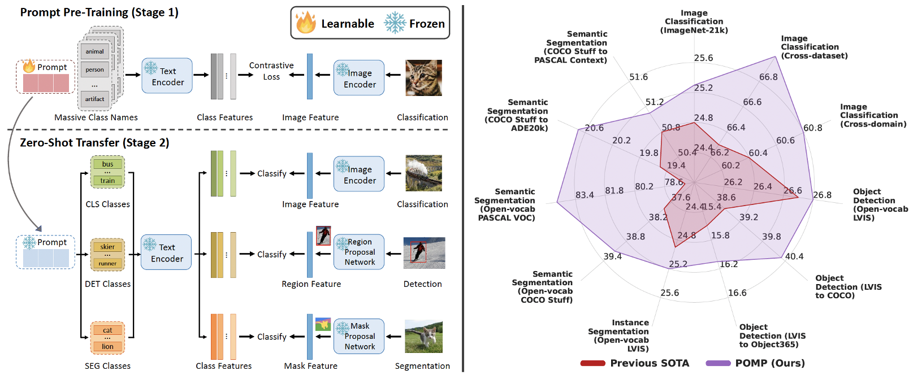

# Prompt Pre-Training with Over Twenty-Thousand Classes for Open-Vocabulary Visual Recognition

> [**Prompt Pre-Training with Over Twenty-Thousand Classes for Open-Vocabulary Visual Recognition**]() 
> [Shuhuai Ren](https://renshuhuai-andy.github.io/), [Aston Zhang](https://www.astonzhang.com/), [Yi Zhu](https://bryanyzhu.github.io/), [Shuai Zhang](https://shuaizhang.tech/), [Shuai Zheng](https://szhengac.github.io/), [Mu Li](http://www.cs.cmu.edu/~muli/), [Alex Smola](https://alex.smola.org/), [Xu Sun](https://xusun.org/index.htm)

# :rocket: News
* **(Feb 8, 2023)** 
  * Codes for prompt pretraining (POMP) on ImageNet-21K, cross-dataset and cross-task evaluation.
  * Checkpoints of pre-trained POMP prompts, segmentation backbones, and detection backbones.

## Highlights

## Main Contributions

1) We introduce a prompt pre-training method POMP, which fisrt enables prompt learning on large-scale datasets like ImageNet-21K with over twenty-thousand classes.
2) POMP is memory and computation efficient. Compared with previous methods like CoOp, it achieves comparable accuracy on ImageNet-1K with only 19\% GPU memory and 50\% training time.
3) POMP achieves new SOTAs on various open-vocabulary visual recognition datasets and tasks.

## Installation 
For installation and other package requirements, please follow the instructions detailed in [INSTALL.md](docs/INSTALL.md). 

## Data preparation
Please follow the instructions at [DATASETS.md](docs/DATASETS.md) to prepare all datasets.

## Pre-trained Models
Please follow the instructions at [MODELS.md](docs/MODELS.md) to prepare all pre-trained models.

## Training and Evaluation
Please refer to the [RUN.md](docs/RUN.md) for detailed instructions on training, evaluating and reproducing the results.

## Contact
If you have any questions, please feel free to create an issue on this repository.

## Acknowledgements

Our code is based on [CoOp](https://github.com/KaiyangZhou/CoOp), [MaPLe](https://github.com/muzairkhattak/multimodal-prompt-learning), [Dassl](https://github.com/KaiyangZhou/Dassl.pytorch), [Detic](https://github.com/facebookresearch/Detic) and [ZSSeg](https://github.com/MendelXu/zsseg.baseline) repositories. We thank the authors for releasing their code. 
